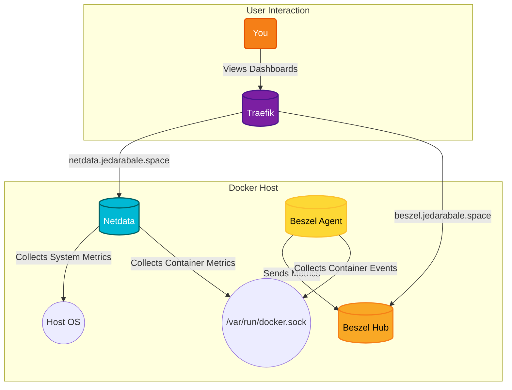

# InfraWatch - Infrastructure Monitoring

A comprehensive monitoring solution that combines the strengths of Netdata and Beszel. Netdata provides high-fidelity, real-time metrics and visualizations for your entire infrastructure, while Beszel offers a lightweight, event-driven approach to container monitoring. Together, they provide a complete picture of your system's health and performance, from low-level system metrics to high-level container events.

## 🚀 Solution Architecture

This diagram shows the architecture of the monitoring stack, with Netdata for metrics and Beszel for container events.



## 🛠️ Setup

This monitoring stack is managed via Docker Compose.

1.  **Environment Variables:** Create a `.env` file in this directory with the following content:
    ```env
    NETDATA_CLAIM_TOKEN=your_netdata_claim_token
    BEZSEL_TOKEN=your_beszel_token
    BEZSEL_KEY=your_beszel_key
    DOMAIN=jedarabale.space
    ```
2.  **Start the containers:**
    ```bash
    docker-compose up -d
    ```
3.  **Access the dashboards:**
    *   **Netdata:** `https://netdata.jedarabale.space`
    *   **Beszel:** `https://beszel.jedarabale.space`
