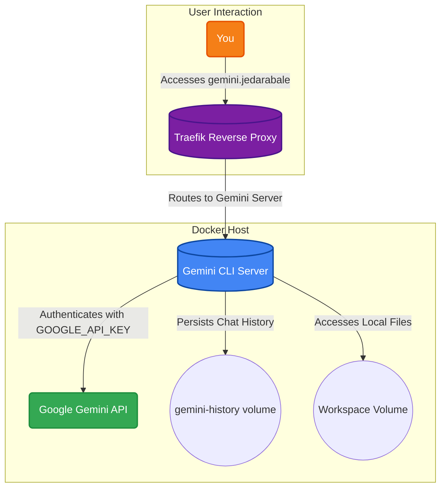

# Gemini CLI Server

This service provides a self-hosted web interface for Google's powerful Gemini family of models. It allows you to leverage the advanced reasoning, code generation, and language understanding capabilities of Gemini directly from your own server, ensuring privacy and control over your data. The persistent history and workspace volumes allow for continuous conversations and access to your local files.

## 🚀 Solution Architecture

This diagram shows how you can interact with the Gemini API through a self-hosted web server.



## 🛠️ Setup

This service is managed via Docker Compose.

1.  **Environment Variables:** Create a `.env` file in the `Docker Apps/traefik` directory with your Cloudflare API token. Then, in the `Docker Apps/gemini-cli` directory, create a `.env` file for your Google API key:
    ```env
    GOOGLE_API_KEY=your_google_api_key
    ```
2.  **Start the container:**
    ```bash
    docker-compose up -d
    ```
3.  **Access the service:** Open your browser and navigate to the host defined in your Traefik routing rule (e.g., `https://gemini.jedarabale`).
