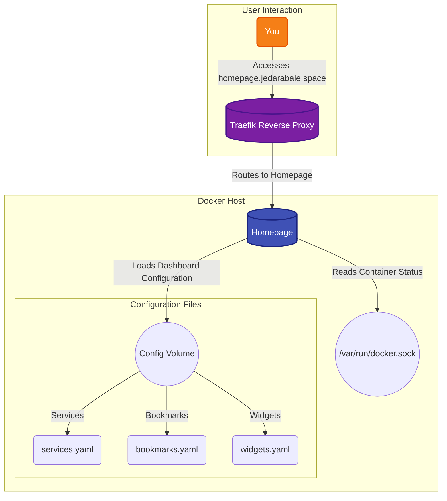

# Homepage Dashboard

A modern, fully static, fast, secure fully proxied, browser-based dashboard.

## 🚀 Solution Architecture

This diagram shows how the homepage dashboard serves as a central hub for accessing your self-hosted services.



## 🛠️ Setup

This service is managed via Docker Compose.

1.  **Customize your dashboard:** Edit the `.yaml` files in the `config` directory to add your own services, bookmarks, and widgets.
    *   `services.yaml`: Define the services to be displayed on the dashboard.
    *   `bookmarks.yaml`: Add your favorite links.
    *   `widgets.yaml`: Configure widgets to display information like CPU usage, memory, etc.
2.  **Start the container:**
    ```bash
    docker-compose up -d
    ```
3.  **Access your dashboard:** Open your browser and navigate to the host defined in your Traefik routing rule (e.g., `https://homepage.jedarabale.space`).
