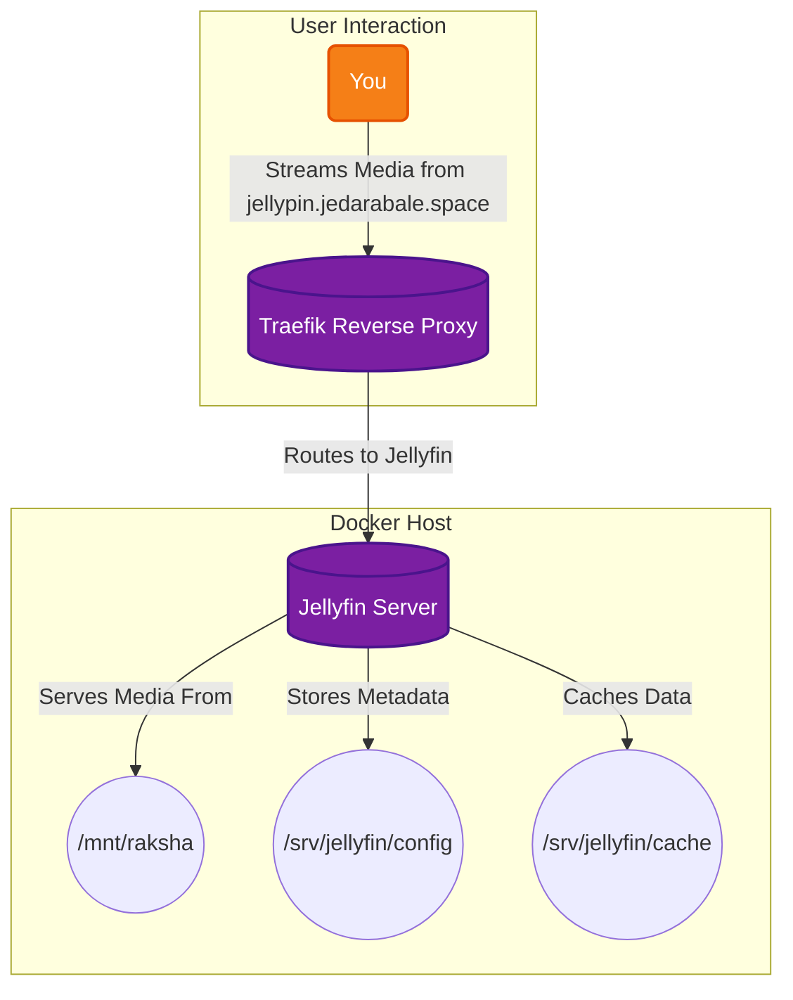

# Jellyfin Media Server

The free and open-source media server that puts you in control of your media. Organize, stream, and share your movies, TV shows, music, and photos to any device, from a web browser to a dedicated client app. With support for a wide range of formats and powerful transcoding capabilities, Jellyfin ensures a smooth streaming experience, wherever you are.

## 🚀 Solution Architecture

This diagram shows how Jellyfin serves your media library to your devices.



## 🛠️ Setup

This Jellyfin instance is managed via Docker Compose.

1.  **Media and Configuration:**
    *   Make sure you have a directory on your host for your media files and map it to `/mnt/raksha` in the `docker-compose.yaml` file.
    *   The configuration and cache for Jellyfin will be stored in `/srv/jellyfin/` on the host.
2.  **Start the container:**
    ```bash
    docker-compose up -d
    ```
3.  **Access Jellyfin:** Open your browser and navigate to `https://jellypin.jedarabale.space` to set up your libraries.
