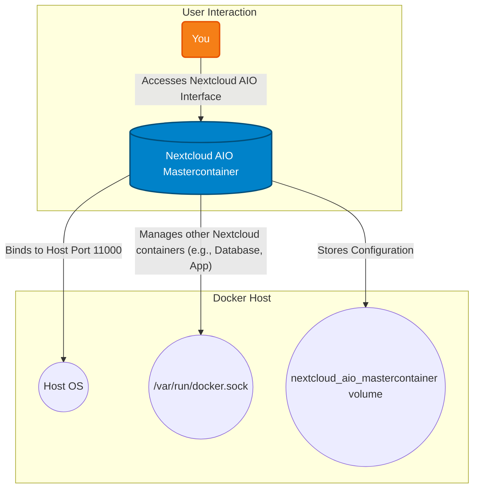

# Nextcloud All-in-One

The Nextcloud All-in-One (AIO) package provides a comprehensive, self-hosted productivity suite that puts you in control of your data. It simplifies the deployment and management of Nextcloud and its recommended components, offering not just file sync and share, but also a rich ecosystem of apps for calendars, contacts, video calls, collaborative document editing, and much more. It's the ultimate solution for taking back your digital sovereignty.

## 🚀 Solution Architecture

This diagram shows the architecture of the Nextcloud All-in-One (AIO) setup. The master container manages all other necessary Nextcloud components.



## 🛠️ Setup

This Nextcloud AIO instance is managed via Docker Compose.

1.  **Start the container:**
    ```bash
    docker-compose up -d
    ```
2.  **Access the AIO interface:** Open your browser and navigate to `https://<ip_of_docker_host>:11000` to perform the initial setup. The All-in-One interface will guide you through the process of starting the other Nextcloud containers.
3.  **Domain Validation:** The `SKIP_DOMAIN_VALIDATION` is set to `true`. For a production setup, you should configure a reverse proxy and set up a valid domain.

**Note on Networking:** This container uses `network_mode: host`, which means it is not proxied through Traefik in this configuration. It binds directly to the host's network.
