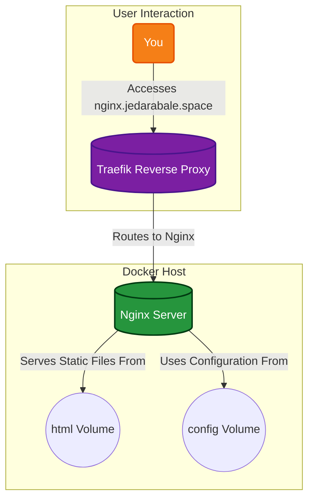

# Nginx Web Server

Nginx is a high-performance, open-source web server known for its stability, rich feature set, and low resource consumption. This container provides a simple and efficient way to serve a static website, but Nginx can also be used as a reverse proxy, load balancer, and HTTP cache, making it a versatile tool for any web-based application.

## 🚀 Solution Architecture

This diagram shows how Nginx serves a static website, with Traefik acting as the reverse proxy.



## 🛠️ Setup

This Nginx instance is managed via Docker Compose.

1.  **Add your website files:** Place your `index.html` and other static files in the `html` directory.
2.  **Start the container:**
    ```bash
    docker-compose up -d
    ```
3.  **Access your website:** Open your browser and navigate to `https://nginx.jedarabale.space`.
