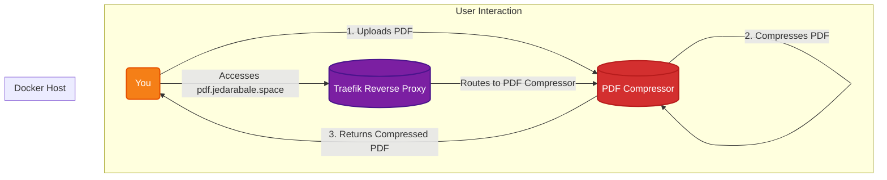

# PDF Compressor

A self-hosted tool to compress PDF files.

## 🚀 Solution Architecture

This diagram shows how the PDF Compressor service is accessed through Traefik to compress your PDF files.



## 🛠️ Setup

This service is managed via Docker Compose.

1.  **Start the container:**
    ```bash
    docker-compose up -d
    ```
2.  **Access the service:** Open your browser and navigate to `https://pdf.jedarabale.space` to start compressing your PDF files.
