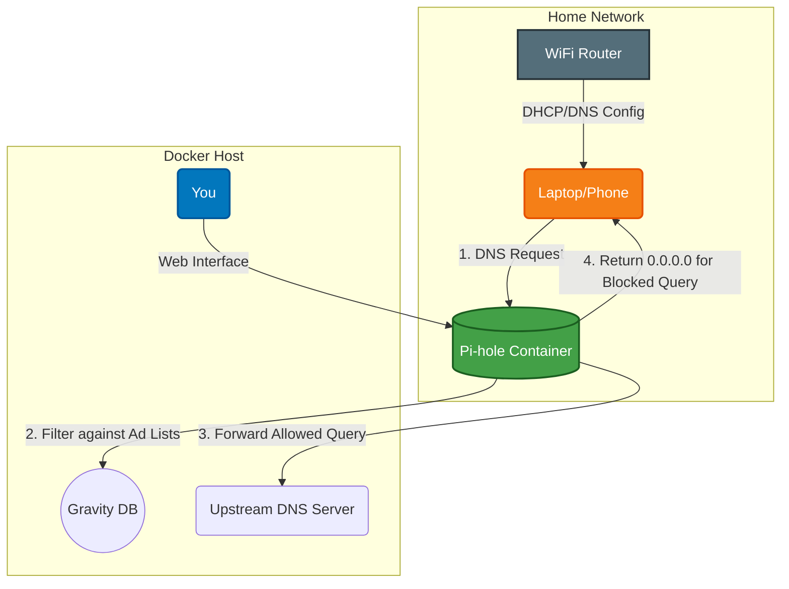

# Pi-hole

A DNS sinkhole that protects your devices from unwanted content, without installing any client-side software.

## 🚀 Solution Architecture

This diagram illustrates how Pi-hole filters DNS requests to block ads and trackers across your network.



## 🛠️ Setup

This Pi-hole instance is managed via Docker Compose.

1.  **Environment Variables:** Create a `.env` file in this directory with the following content:
    ```env
    PIHOLE_PASSWORD=your_admin_password
    ```
2.  **Start the container:**
    ```bash
    docker-compose up -d
    ```
3.  **Configure your network:** Point your router's DNS settings to the IP address of the Docker host.
