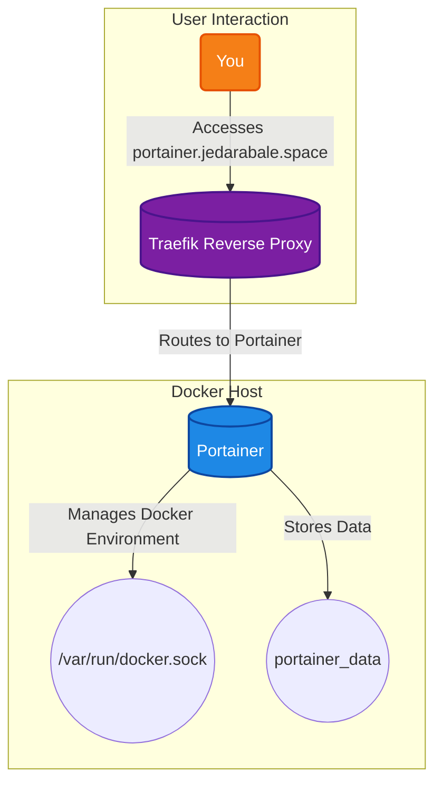

# Portainer

A powerful, lightweight management UI that allows you to easily manage your Docker environments. With Portainer, you can inspect and manage containers, images, volumes, and networks, deploy applications from stacks, and monitor your Docker host, all from an intuitive web interface. It simplifies the complexities of the command line and provides a clear overview of your containerized applications.

## 🚀 Solution Architecture

This diagram shows how Portainer provides a web interface to manage your Docker environment.



## 🛠️ Setup

This Portainer instance is managed via Docker Compose.

1.  **Start the container:**
    ```bash
    docker-compose up -d
    ```
2.  **Access Portainer:** Open your browser and navigate to `https://portainer.jedarabale.space`.
3.  **Initial Setup:** On your first visit, you will be asked to create an admin user and connect to a Docker environment. Choose the "Docker" option and connect to the local Docker socket.
