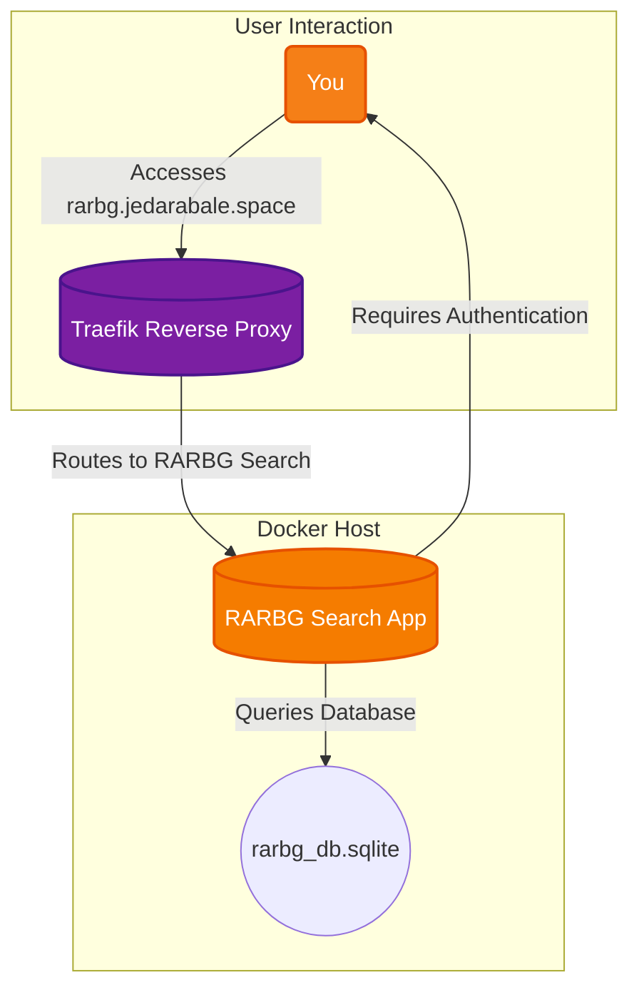

# RARBG Search

A simple web interface to search a local copy of the RARBG database.

## 🚀 Solution Architecture

This diagram shows how the RARBG search application provides a web interface to a SQLite database.



## 🛠️ Setup

This service is managed via Docker Compose and is built from the local Dockerfile.

1.  **Database:** Place your `rarbg_db.sqlite` file in this directory.
2.  **Start the container:**
    ```bash
    docker-compose up -d --build
    ```
3.  **Access the service:** Open your browser and navigate to `https://rarbg.jedarabale.space`.

## ⚠️ Security Warning

The application currently uses hardcoded credentials in `main.py`. It is strongly recommended to change these credentials or implement a more secure authentication method.
