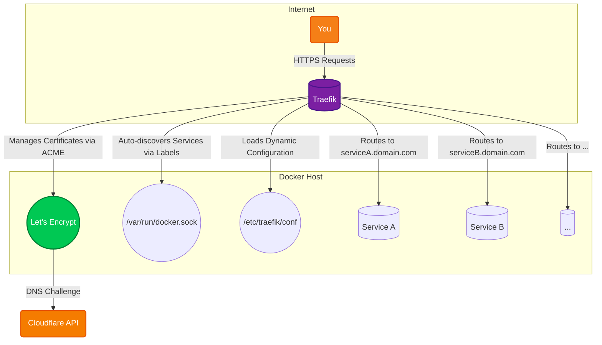

# Traefik Reverse Proxy

The cloud-native application proxy. It routes traffic to all the self-hosted services and handles SSL termination.

## 🚀 Solution Architecture

This diagram shows how Traefik acts as the entry point for all incoming traffic, automatically discovering services and securing them with SSL.



## 🛠️ Setup

Traefik is managed via Docker Compose and is the core of this self-hosting setup.

1.  **Environment Variables:** Create a `.env` file in this directory with your Cloudflare API token for automatic SSL certificate generation.
    ```env
    CF_DNS_API_TOKEN=your_cloudflare_dns_api_token
    ```
2.  **Configuration:**
    *   `traefik.yaml`: Main configuration file for Traefik.
    *   `conf/`: Directory for dynamic configuration files (e.g., middlewares, TLS options).
    *   `certs/`: Directory for storing generated SSL certificates.
3.  **Start the container:**
    ```bash
    docker-compose up -d
    ```
4.  **Dashboard:** Access the Traefik dashboard at `http://<ip_of_docker_host>:8080` to see the status of your services.
