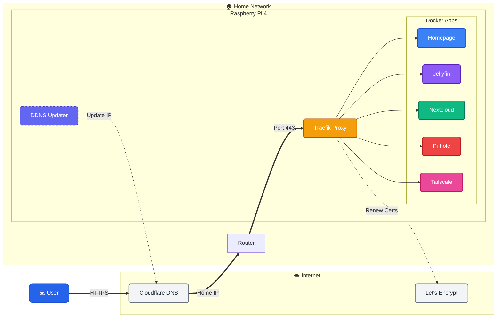

# 🏠 Self-Hosted Home Lab

This repository documents a self-hosted home lab running on a **Raspberry Pi 4 (8GB)**. It features a secure, automated HTTPS setup using Traefik, Let's Encrypt, and Cloudflare DDNS to handle dynamic IPs from the ISP (Airtel).

## ️ Architecture & Security Flow

We use **Traefik** as the central entry point (Reverse Proxy) which automatically manages SSL certificates. Since our ISP provides a dynamic IP, a **DDNS script** ensures our domain always points to the correct home address.

## 🌐 Connectivity Logic

### 1. Dynamic DNS (DDNS)
**Problem:** Airtel Broadband changes the Public IP address frequently.
**Solution:** We use the [Cloudflare DDNS Updater](https://github.com/K0p1-Git/cloudflare-ddns-updater) script.
- **Function:** It runs periodically to check the current Public IP.
- **Action:** If the IP has changed, it updates the `A` records in Cloudflare DNS via API.
- **Result:** `*.example.com` always resolves to the home network.

### 2. Reverse Proxy & HTTPS (Traefik)
**Role:** Secure Gateway.
- **Traefik** listens on ports 80 and 443.
- **Let's Encrypt Integration:** Traefik automatically communicates with Let's Encrypt to generate and renew valid SSL certificates for all subdomains.
- **Force HTTPS:** All HTTP (Port 80) traffic is automatically redirected to HTTPS (Port 443).

## 🛠️ Hardware & Software

| Device | Role | Key Services |
|--------|------|--------------|
| **Raspberry Pi 4 (8GB)** | All-in-One Server | Docker, Traefik, Jellyfin, Nextcloud, DDNS Script |
