# 🏠 Self-Hosted Home Lab - Technical Architecture

A production-grade self-hosted home lab on **Raspberry Pi 4 (8GB)** with containerized services, automated TLS/SSL, reverse proxy routing, and secure DNS management using industry-standard tools: **Traefik**, **Let's Encrypt**, **Cloudflare**, and **Docker**.

## 🏗️ System Architecture Overview

```mermaid
%%{init: {
  'theme': 'base',
  'themeVariables': {
    'background': '#F5F7FA',
    'primaryTextColor': '#1F2937',
    'fontSize': '13px'
  },
  'flowchart': { 'rankSpacing': 25, 'nodeSpacing': 20 }
}}%%
flowchart TB
    classDef external fill:#FEF3C7,stroke:#D97706,stroke-width:2px,color:#1F2937,rx:6,ry:6,font-weight:bold
    classDef cloudflare fill:#DBEAFE,stroke:#0284C7,stroke-width:2px,color:#1E3A8A,rx:6,ry:6,font-weight:bold
    classDef router fill:#E0E7FF,stroke:#4F46E5,stroke-width:2px,color:#1E3A8A,rx:6,ry:6,font-weight:bold
    classDef traefik fill:#F0FDF4,stroke:#16A34A,stroke-width:2px,color:#15803D,rx:6,ry:6,font-weight:bold
    classDef docker fill:#F3E8FF,stroke:#A855F7,stroke-width:2px,color:#6B21A8,rx:6,ry:6,font-weight:bold
    classDef storage fill:#FECACA,stroke:#DC2626,stroke-width:1px,color:#7F1D1D,rx:6,ry:6,font-family:monospace
    classDef letsencrypt fill:#CCFBF1,stroke:#0D9488,stroke-width:2px,color:#134E4A,rx:6,ry:6,font-weight:bold

    %% External Layer
    Client["👥 <b>External Clients</b>
    (HTTPS Requests)"]:::external

    %% DNS Layer
    subgraph DNS["🌐 DNS Resolution Layer"]
        CF_DNS["☁️ Cloudflare DNS
        A Record: example.com → Public IP
        CNAME Records: *.example.com"]:::cloudflare
        DDNS["🔄 DDNS Updater
        (Cron: every 5 mins)
        Detects IP changes
        Updates via CF API"]:::router
    end

    %% Network Layer
    subgraph Network["🏠 Home Network Layer"]
        ISP["🌍 ISP (Airtel)
        Dynamic Public IP
        Port Forwarding: 80/443"]:::external
        Router["🚀 Home Router
        NAT + Port Forward
        :80 → Traefik
        :443 → Traefik"]:::router
    end

    %% Traefik Layer
    subgraph Reverse["🚦 Traefik Reverse Proxy Layer"]
        Traefik["<b>Traefik</b>
        Listens: 0.0.0.0:80, :443
        Rules Engine
        Load Balancer"]:::traefik
        LE["🔐 Let's Encrypt Client
        ACME Protocol (v2)
        Auto Renewal (30 days before expiry)
        Stores certs in volume"]:::letsencrypt
    end

    %% Docker Layer
    subgraph Containers["🐳 Docker Container Stack"]
        direction TB
        subgraph Apps["📦 Application Containers"]
            Jellyfin["🎬 Jellyfin
            Service: jellyfin:8096
            Label: jellyfin.example.com"]:::docker
            Nextcloud["☁️ Nextcloud
            Service: nextcloud:80
            Label: cloud.example.com"]:::docker
            Heimdall["🖥️ Heimdall Dashboard
            Service: heimdall:80
            Label: home.example.com"]:::docker
            Pihole["🛡️ Pi-hole
            Service: pihole:80
            Label: dns.example.com"]:::docker
        end
        
        subgraph Storage["💾 Persistent Storage"]
            Vol1["📁 /media - Media Library"]:::storage
            Vol2["📁 /nextcloud - Cloud Storage"]:::storage
            Vol3["📁 /traefik - Certs & Config"]:::storage
        end
    end

    %% Connections
    Client -->|"HTTPS :443"| CF_DNS
    CF_DNS -->|"Resolves to Public IP"| ISP
    DDNS -->|"Updates A records"| CF_DNS
    ISP -->|"Port Forward :443"| Router
    Router -->|"Routes to :443"| Traefik
    Traefik -->|"TLS Handshake + Routing"| LE
    LE -->|"ACME Challenge"| CF_DNS
    Traefik -->|"Service Discovery"| Apps
    Apps -->|"Persist Data"| Storage

    %% Link Styles
    linkStyle 0,1 stroke:#D97706,stroke-width:2px
    linkStyle 2 stroke:#0284C7,stroke-width:2px
    linkStyle 3,4,5 stroke:#4F46E5,stroke-width:2px
    linkStyle 6 stroke:#16A34A,stroke-width:2px
    linkStyle 7,8 stroke:#A855F7,stroke-width:2px
    linkStyle 9 stroke:#DC2626,stroke-width:1px
```

## 🔐 Traefik + Let's Encrypt Certificate Lifecycle

```mermaid
%%{init: {
  'theme': 'base',
  'themeVariables': {
    'background': '#F5F7FA',
    'primaryTextColor': '#1F2937',
    'fontSize': '12px'
  },
  'flowchart': { 'rankSpacing': 20, 'nodeSpacing': 15 }
}}%%
flowchart LR
    classDef boot fill:#FEE2E2,stroke:#DC2626,stroke-width:2px,color:#7F1D1D,rx:5,ry:5
    classDef acme fill:#CCFBF1,stroke:#0D9488,stroke-width:2px,color:#134E4A,rx:5,ry:5,font-weight:bold
    classDef challenge fill:#F3E8FF,stroke:#A855F7,stroke-width:2px,color:#6B21A8,rx:5,ry:5
    classDef stored fill:#DBEAFE,stroke:#0284C7,stroke-width:2px,color:#1E3A8A,rx:5,ry:5
    classDef client fill:#FEF3C7,stroke:#D97706,stroke-width:2px,color:#1F2937,rx:5,ry:5

    Start["🚀 Traefik Starts
    Reads docker-compose.yml
    Discovers services via labels"]:::boot

    ACME["📋 ACME Account Check
    Uses existing account OR
    Creates new one
    (acme.json saved)"]:::acme

    Discover["🔍 Service Discovery
    Finds labels:
    - traefik.http.routers
    - traefik.http.services"]:::boot

    Domain["🌍 Collect Domains
    Extract from router rules
    e.g., Host('jellyfin.example.com')"]:::client

    Challenge["⚡ ACME Challenge (DNS-01)
    Traefik requests CF API token
    Creates TXT record in DNS
    LE validates: _acme-challenge.example.com"]:::challenge

    Verify["✅ Let's Encrypt Verifies
    Queries TXT record
    Confirms domain ownership
    Issues signed certificate"]:::acme

    Store["💾 Store Certificate
    Saves to acme.json
    Path: /traefik/acme.json
    (Docker volume)"]:::stored

    Load["🔑 Load into Traefik
    TLS certificate ready
    Listens on :443
    Serves HTTPS to clients"]:::boot

    Renew["🔄 Auto-Renewal Check
    Runs 30 days before expiry
    Repeats ACME challenge
    Transparent to users"]:::acme

    Start --> ACME
    ACME --> Discover
    Discover --> Domain
    Domain --> Challenge
    Challenge --> Verify
    Verify --> Store
    Store --> Load
    Load --> Renew
    Renew -.->|"Loop (every 24h)"| Challenge

    %% Link Styles
    linkStyle 8 stroke:#0D9488,stroke-width:2px,stroke-dasharray: 5 5
```



## 🔄 DDNS Update Flow with Cloudflare API

```mermaid
%%{init: {
  'theme': 'base',
  'themeVariables': {
    'background': '#F5F7FA',
    'primaryTextColor': '#1F2937',
    'fontSize': '12px'
  },
  'flowchart': { 'rankSpacing': 18, 'nodeSpacing': 15 }
}}%%
flowchart LR
    classDef cron fill:#FEE2E2,stroke:#DC2626,stroke-width:2px,color:#7F1D1D,rx:5,ry:5,font-weight:bold
    classDef detect fill:#FEF3C7,stroke:#D97706,stroke-width:2px,color:#1F2937,rx:5,ry:5
    classDef compare fill:#F3E8FF,stroke:#A855F7,stroke-width:2px,color:#6B21A8,rx:5,ry:5
    classDef api fill:#DBEAFE,stroke:#0284C7,stroke-width:2px,color:#1E3A8A,rx:5,ry:5,font-weight:bold
    classDef update fill:#CCFBF1,stroke:#0D9488,stroke-width:2px,color:#134E4A,rx:5,ry:5
    classDef success fill:#C7D2FE,stroke:#4F46E5,stroke-width:2px,color:#1E3A8A,rx:5,ry:5

    Trigger["⏰ Cron Job Triggers
    Schedule: */5 * * * *
    (every 5 minutes)"]:::cron

    GetIP["🔍 Detect Public IP
    curl ifconfig.me
    OR
    curl api.ipify.org"]:::detect

    GetDNS["📡 Query Cloudflare DNS
    CF API: GET zone
    Current A record IP
    Headers: X-Auth-Email, X-Auth-Key"]:::api

    Compare["⚖️ Compare IPs
    Local Public IP
    vs
    Cloudflare A Record"]:::compare

    NoChange{"IPs Match?"}:::compare

    Change["🔀 IPs Different
    Prepare update payload"]:::detect

    APICall["🌐 Call Cloudflare API
    PUT /zones/{zone_id}/dns_records/{id}
    Content: new IP address
    Auth: API Token"]:::api

    Response{"200 OK Response?"}:::api

    Success["✅ Update Successful
    A record now points to
    current Public IP
    Log: SUCCESS"]:::success

    Fail["❌ Update Failed
    Log error
    Retry next cycle"]:::update

    NoLog["⏭️ Skip Update
    IP unchanged
    Log: NO_CHANGE"]:::update

    Trigger --> GetIP
    GetIP --> GetDNS
    GetDNS --> Compare
    Compare --> NoChange
    NoChange -->|"Yes"| NoLog
    NoChange -->|"No"| Change
    Change --> APICall
    APICall --> Response
    Response -->|"Yes"| Success
    Response -->|"No"| Fail

    %% Link Styles
    linkStyle 0,1,2 stroke:#DC2626,stroke-width:2px
    linkStyle 3,4 stroke:#D97706,stroke-width:2px
    linkStyle 5,6,7 stroke:#0284C7,stroke-width:2px
    linkStyle 8,9,10 stroke:#4F46E5,stroke-width:2px
    linkStyle 11 stroke:#0D9488,stroke-width:2px
    linkStyle 12 stroke:#DC2626,stroke-width:2px
```

## ☁️ Cloudflare Tunnel vs DDNS + Port Forward

```mermaid
%%{init: {
  'theme': 'base',
  'themeVariables': {
    'background': '#F5F7FA',
    'primaryTextColor': '#1F2937',
    'fontSize': '12px'
  },
  'flowchart': { 'rankSpacing': 20, 'nodeSpacing': 15 }
}}%%
flowchart TB
    classDef current fill:#C7D2FE,stroke:#4F46E5,stroke-width:2px,color:#1E3A8A,rx:6,ry:6,font-weight:bold
    classDef alternative fill:#FEE2E2,stroke:#DC2626,stroke-width:2px,color:#7F1D1D,rx:6,ry:6,font-weight:bold
    classDef step fill:#DBEAFE,stroke:#0284C7,stroke-width:2px,color:#1E3A8A,rx:5,ry:5
    classDef benefit fill:#CCFBF1,stroke:#0D9488,stroke-width:2px,color:#134E4A,rx:5,ry:5
    classDef issue fill:#FEF3C7,stroke:#D97706,stroke-width:2px,color:#1F2937,rx:5,ry:5

    subgraph Current["✅ CURRENT: DDNS + Port Forward (Used)"]
        CF1["☁️ Cloudflare DNS
        Stores A record"]:::step
        DDNS1["🔄 DDNS Script
        Updates A record on IP change
        Public IP → A Record"]:::step
        PF["🚀 Port Forward
        Router :80,:443 → Traefik
        Direct connection"]:::step
        TRK["🚦 Traefik
        Handles HTTPS
        Routes to containers"]:::step
        
        B1["✅ Low latency"]:::benefit
        B2["✅ Full control"]:::benefit
        B3["✅ Self-hosted"]:::benefit
        
        I1["⚠️ ISP may block ports"]:::issue
        I2["⚠️ Manual setup"]:::issue
        I3["⚠️ Requires DDNS"]:::issue
    end

    subgraph Alternative["❌ ALTERNATIVE: Cloudflare Tunnel (Not Used)"]
        CT["🌐 Cloudflare Tunnel
        Daemon: cloudflared"]:::step
        CTO["📤 Outbound Connection
        :localhost:80 → CF Edge
        Secure tunnel created"]:::step
        CFEDGE["☁️ Cloudflare Edge
        Public endpoint
        Routes to tunnel"]:::step
        CFREQ["📥 Request routing
        Client → CF Edge → Tunnel → Traefik"]:::step
        
        B4["✅ No port forwarding"]:::benefit
        B5["✅ NAT bypass"]:::benefit
        B6["✅ Zero Trust security"]:::benefit
        
        I4["⚠️ Higher latency"]:::issue
        I5["⚠️ CF dependency"]:::issue
        I6["⚠️ Slower for local access"]:::issue
    end

    CF1 --> DDNS1
    DDNS1 --> PF
    PF --> TRK
    TRK --> B1
    TRK --> B2
    TRK --> B3
    TRK --> I1
    TRK --> I2
    TRK --> I3

    CT --> CTO
    CTO --> CFEDGE
    CFEDGE --> CFREQ
    CFREQ --> B4
    CFREQ --> B5
    CFREQ --> B6
    CFREQ --> I4
    CFREQ --> I5
    CFREQ --> I6
```



## 🐳 Docker Compose Service Architecture

Your services are orchestrated via Docker with labels that Traefik reads automatically:

```yaml
# Key Services & Traefik Integration

# 1. TRAEFIK - Reverse Proxy & Load Balancer
traefik:
  image: traefik:v2.x
  labels:
    # Dashboard (traefik.example.com)
    traefik.http.routers.traefik.rule: "Host(`traefik.example.com`)"
