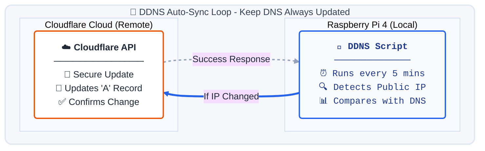
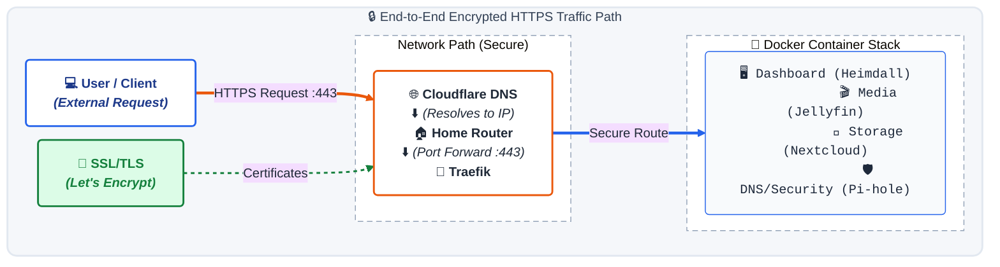

# 🏠 Self-Hosted Home Lab

This repository documents a self-hosted home lab running on a **Raspberry Pi 4 (8GB)**. It features a secure, automated HTTPS setup using Traefik, Let's Encrypt, and Cloudflare DDNS to handle dynamic IPs from the ISP (Airtel).

## 🏗️ Architecture & Security Flow

We use **Traefik** as the central entry point (Reverse Proxy) which automatically manages SSL certificates. Since our ISP provides a dynamic IP, a **DDNS script** ensures our domain always points to the correct home address.

## 🌐 Connectivity & Security Logic

### 1. Dynamic DNS (DDNS) - Keep Your Domain Updated
**Problem:** Airtel Broadband changes the Public IP address frequently (no static IP).

**Solution:** [Cloudflare DDNS Updater](https://github.com/K0p1-Git/cloudflare-ddns-updater)
- **How it works:** 
  - Runs as a scheduled Cron job (every 5 minutes)
  - Detects the current Public IP
  - Compares it with the DNS `A` record in Cloudflare
  - If changed, automatically updates via Cloudflare API
- **Result:** `*.example.com` always resolves to your home network, even when ISP changes your IP

### 2. Reverse Proxy & HTTPS (Traefik) - Secure Gateway
**Role:** Manages all incoming traffic and SSL certificates.
- **Listens on:** Ports 80 (HTTP) and 443 (HTTPS)
- **Let's Encrypt Integration:** 
  - Automatically requests SSL certificates for all subdomains
  - Handles certificate renewal before expiration
- **HTTP → HTTPS Redirect:** All unencrypted traffic is redirected to secure HTTPS

### 3. Cloudflare DNS & Security (Optional Tunnel Alternative)
You can optionally use **Cloudflare Tunnel** instead of manual port forwarding:

| Method | Pros | Cons |
|--------|------|------|
| **DDNS + Port Forward** (Current) | Full control, Lower latency, Self-hosted | Manual port setup, ISP may block ports, Dynamic IP updates needed |
| **Cloudflare Tunnel** | No port forwarding needed, NAT bypass, Zero Trust Security | Added latency, Cloudflare dependency, Slower for local users |

**Current Setup:** Uses DDNS + Port Forward (443) → More performant for home network access

## 🛠️ Hardware & Software Stack

| Component | Role | Key Services |
|-----------|------|--------------|
| **Raspberry Pi 4 (8GB)** | Central Server | Docker Engine, Traefik Reverse Proxy, Let's Encrypt, DDNS Script, Cron Scheduler |
| **Cloudflare DNS** | DNS Management | Domain Resolution, DDNS Updates via API, DDoS Protection |
| **Docker Containers** | Applications | Jellyfin (Media), Nextcloud (Cloud Storage), Pi-hole (DNS/Security), Heimdall (Dashboard) |
| **Traefik** | Entry Point | SSL Termination, Load Balancing, Automatic Certificate Management |
