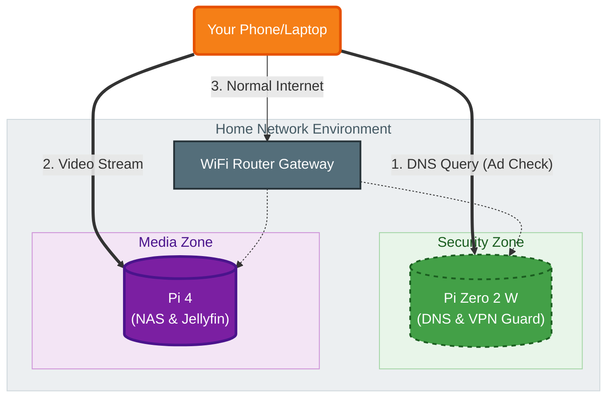

# 🛡️ 01. Network Security Layer

**Device:** Raspberry Pi Zero 2 W  
**OS:** Raspberry Pi OS Lite (64-bit)  
**IP:** Static (e.g., 192.168.1.5)

## 🧩 Split-Tunnel Architecture
This setup uses the "Split DNS" method to block ads without slowing down internet speed.



## 🛠️ Installation Commands
```bash
# Install Pi-hole
curl -sSL [https://install.pi-hole.net](https://install.pi-hole.net) | bash

# Install Tailscale
curl -fsSL [https://tailscale.com/install.sh](https://tailscale.com/install.sh) | sh

# Install Log2Ram (Protect SD Card)
echo "deb [http://packages.azlux.fr/debian/](http://packages.azlux.fr/debian/) buster main" | sudo tee /etc/apt/sources.list.d/azlux.list
sudo apt install log2ram
```
